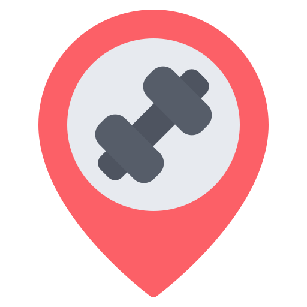

<style>
  table {
    width: 100%;
    border-collapse: collapse;
  }
  th, td {
    border: 1px solid black;
    padding: 8px;
    text-align: left;
  }
</style>

<div align="center">



# **GympassAPI**

✨ A copy (or something like) of the Gympass API. Node.js & Typescript based, developed with concepts like SOLID, DDD, TDD, Repository Pattern, Factory Method and RBAC system. Has unit test for especific use-cases and test E2E for every HTTP controller. ✨

[](https://github.com/pedrohenrikle/gympass-api)
[](https://opensource.org/licenses/MIT)

</div>

## Table of contents

- [Why GympassAPI?](#why-gympassapi)
- [Getting Started](#getting-started)
- [Features](#🛠️-features)
  - [Functional requirements](#frs-functional-requirements)
  - [Business rules](#brs-business-rules)
  - [Non-functional requirements](#nfrs-non-functional-requirements)
- [Endpoints](#🛑-endpoints)
  - [Users](#users)
  - [Gyms](#gyms)
  - [Check-Ins](#check-ins)
- [Technologies](#🚀-technologies)
- [License](#📝-license)
- [Author](#✍-author)

## Why GympassAPI?

GympassAPI was a project to better learn the concepts involved in the backend, such as SOLID concepts, the principles of DDD and TDD. I also learned about the RBAC authorization system, the use of the JWT token, authentication and validation systems and much more.


## Getting Started

To get started with GympassAPI, follow these simple steps:

### 1. Installation

First of all, clone the repository and install de dependencies.

```shell
npm install
```

### 2. Setting up your environment

Now we must setup our environment variables. Create a file on root as ***.env***. Inside, put all data like is on .env.example

```shell
NODE_ENV=dev

# Auth
JWT_SECRET=YOUR_SECRET_HERE

# Database
DATABASE_URL="url_from_your_database"
```

### 3. Create a Database

There is a `docker-compose.yml` file inside the project, so if you want to create the container as I thot, you can run the following command

```shell
docker compose up -d
```

and if you want to stop the container

```shell
docker compose stop
```

## 🛠️ Features

### FRs (Functional requirements)

- [x] It must be possible to register;
- [x] It must be possible to authenticate;
- [x] It must be possible to obtain the profile of a logged-in user;
- [x] It must be possible to obtain the number of check-ins carried out by the logged-in user;
- [x] It must be possible for the user to obtain their check-in history;
- [x] It must be possible for the user to search for nearby gyms (up to 10km);
- [x] It must be possible for the user to search for gyms by name;
- [x] It must be possible for the user to check-in at a gym;
- [x] It must be possible to validate a user's check-in;
- [x] It must be possible to register a gym;

### BRs (Business Rules)

- [x] The user must not be able to register with a duplicate e-mail address;
- [x] The user cannot make 2 check-ins on the same day;
- [x] The user cannot check in if they are not close (100m) to the gym;
- [x] The check-in can only be validated up to 20 minutes after it has been created;
- [x] The check-in can only be validated by administrators;
- [x] The gym can only be registered by administrators;

### NFRs (Non-functional requirements)

- [x] The user's password must be encrypted;
- [x] The application data must be persisted in a PostgreSQL database;
- [x] All data lists must be paginated with 20 items per page;
- [x] The user must be identified by a JWT (JSON Web Token);

## 🛑 Endpoints

Here you can see all the endpoints of the application

### Users

- ```POST - '/users'```
  - This is the user's entry route, where the user will register with on the application. You must send the request with a ***data*** equal a some user's informations on the body of the requisition.
  <br><br>

    | Params       | Type        | Default    |
    | :---         | :---        | :---       |
    | `name`       | **string**  | -          |
    | `email`      | **string**  | -          |
    | `password`   | **string**  | -          |
    | `role`       | **string**  | `'MEMBER'` |


<br><br>

- `POST - '/sessions'`
  - This is the authenticate route. Here, the user can log-in on our application. Send this data as the body of the request as a JSON. After that, we will generate a access token that contains the **user ID** and about his **role**.
  <br><br>

    | Params       | Type       | Default  |
    | :---         | :---       | :---     |
    | `email`      | **string** | -        |
    | `password`   | **string** | -        |

<br><br>

- ```PATCH - '/token/refresh'```
  - This the route where, if you have a refresh token, we will generate another JWT Token.
  <br><br>

<br><br>

- ```GET - '/me'```
  - This route requires that you already be logged-in. Here, you send your requisition with a JWT Token as authorization.
  <br><br>

    | Header           | Type       | 
    | :---             | :---       | 
    | `Authorization`  | **Bearer** |

  will be something like this

  ```ts
  fetch(url, {
    method: 'GET',
    headers: {
      'Authorization': `Bearer ${token}`,
      'Content-Type': 'application/json' 
    }
  })
  ```

### Gyms

On ***Gyms***, every route needs to be authenticated, that means every request must have the following header: `Authorization Bearer ${token}`. Some routes also require `role = 'ADMIN'`.

- ```GET - '/gyms/search'```
  - Here you can search gyms by their name. You must send the request with a ***query*** as **q** on the body of the requisition as a JSON.
  <br><br>

    | Params       | Type       | Default  |
    | :---         | :---       | :---     |
    | `q`          | **string** | -        |
    | `page`       | **number** | 1        |

<br><br>

- ```GET - '/gyms/nearby'```
  - Here you can find nearby gyms based on latitude and longitude of the user. You must send the request with a ***latitude*** and ***longitude*** of the user on the body of the requisitionas as a JSON.

    | Params         | Type       | Default  |
    | :---           | :---       | :---     |
    | `latitude`     | **number** | -        |
    | `longitude`    | **number** | -        |

<br><br>

- ```POST - '/gyms'```
  - Here we create a new Gym on database. You must do this as a `'ADMIN'` user so your access token must have this proprerty. You can pass the informations of the gym on the body of the requisition as a JSON.

    | Params         | Type       | Default  |
    | :---           | :---       | :---     |
    | `title`        | **string** | -        |
    | `description`  | **string** | -        |
    | `phone`        | **number** | -        |
    | `latitude`     | **number** | -        |
    | `longitude`    | **number** | -        |

### Check Ins

On ***Check Ins***, every route needs to be authenticated.

- ```GET - '/check-ins/history'```
  - Here we can take the history of all check-ins that the user made it. You must just provide your JWT Token for the authorization.

    | Header           | Type       | 
    | :---             | :---       | 
    | `Authorization`  | **Bearer** |

  will be something like this

    ```ts
    fetch(url, {
      method: 'GET',
      headers: {
        'Authorization': `Bearer ${token}`,
        'Content-Type': 'application/json' 
      }
    })
    ```
<br><br>

- ```GET - '/check-ins/metrics'```
  - Here we can take the metrics of the user. You must just provide your JWT Token for the authorization.

    | Header           | Type       | 
    | :---             | :---       | 
    | `Authorization`  | **Bearer** |

  will be something like this

  ```ts
  fetch(url, {
    method: 'GET',
    headers: {
      'Authorization': `Bearer ${token}`,
      'Content-Type': 'application/json' 
    }
  })
  ```

<br><br>

- ```POST - '/gyms/:gymId/check-ins'```
  - Here we can create a check-in on a gym. You must provide on the URL param the id of the gym as **gymID** and on the body of the request the **latitude** and **longitude** of the user as a JSON

    | Params         | Type       | Default  |
    | :---           | :---       | :---     |
    | `gymId`        | **string** | -        |
    | `latitude`     | **number** | -        |
    | `longitude`    | **number** | -        |

<br><br>

- ```POST - '/check-ins/:checkInId/validate'```
  - Here we validate the check-in of the user. You must do this as a `'ADMIN'` user so your access token must have this proprerty. You also must provide on the URL param the **checkInId** as the check-in that will be validated.

    | Params         | Type       | Default  |
    | :---           | :---       | :---     |
    | `checkInId`    | **string** | -        |


## 🚀 Technologies
  The technologies used to develop this application was:
  - [nodejs](https://nodejs.org/en)
  - [typescript](https://www.typescriptlang.org/)
  - [fastify](https://fastify.dev/)
  - [@fastify/cookie](https://github.com/fastify/fastify-cookie)
  - [@fastify/jwt](https://github.com/fastify/fastify-jwt)
  - [prisma](https://www.prisma.io/)
  - [zod](https://zod.dev/)
  - [vitest](vitest.dev)
  - [supertest](https://github.com/ladjs/supertest)
  - [dayjs](https://day.js.org/en/)
  - [tsup](https://github.com/egoist/tsup)
  - [dotenv](https://github.com/motdotla/dotenv)
  - [bcryptjs](https://github.com/dcodeIO/bcrypt.js)
  - [eslint](https://eslint.org/)

## 📝 License
GympassAPI is released under the MIT License.


## ✍ Author
<br>

<div style="display: flex; flex-direction: column; gap: 0.5rem">
  
  <p>
      Made with 💜 by Pedro Henrique Klein
  </p>
  <div style="display: flex; align-item: center; gap: 1rem">
      <a href="https://www.linkedin.com/in/pedro-klein/" target="_blank">
          
      </a>
      <a href="mailto:pedro.klein.sl@gmail.com" target="_blank">
          
      </a>
  </div>
</div>